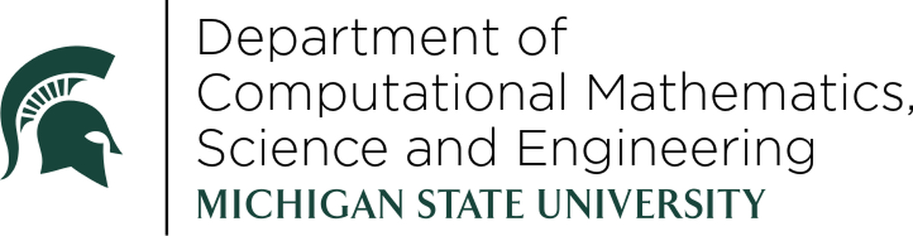

Welcome to Graph Methods in TDA 2026! 
  
  
This workshop brings together researchers working on graph signatures,
Reeb graphs, and the Mapper algorithm, from theoretical foundations
to real-world applications. We aim to foster connections between
pure mathematics, computer science, and data science.

 
 
We welcome participants from all career stages, from graduate students to senior researchers.

  

Dates

July 27–29, 2026

  

Location

Michigan State University

  

Format

In-person

  

Registration

Open now

## About the Workshop

This workshop focuses on graph signatures and their role in topological data analysis,
with particular emphasis on Reeb graphs and the Mapper algorithm. We bring together
researchers working on the theoretical foundations of these methods as well as those
developing practical applications of Mapper in real-world settings.

Topics include:

- Reeb graphs: theory, computation, and metrics
- The Mapper algorithm and its applications
- Graph signatures and invariants
- Persistent homology on graphs and networks
- Applications of TDA to biological, social, and scientific data
- Connections between graph-based methods and broader TDA theory

## Organizers

  <a class="org-pill" href="https://elizabethmunch.com/" target="_blank">Elizabeth Munch (MSU)</a>
  <a class="org-pill" href="https://wolfchambers.github.io/" target="_blank">Erin Wolf Chambers (Notre Dame)</a>
  <a class="org-pill" href="https://www.math.unm.edu/~sarah/" target="_blank">Sarah Percival (U of New Mexico)</a>
  <a class="org-pill" href="https://ishikaghosh.com/" target="_blank">Ishika Ghosh (MSU)</a>

Questions? Email us at [muncheli@msu.edu](mailto:muncheli@msu.edu).

## Sponsors

   
  

